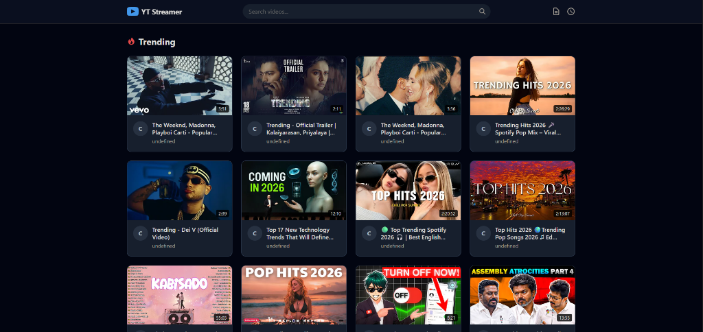
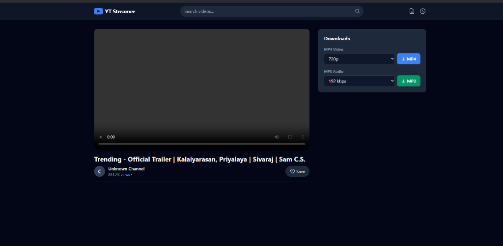
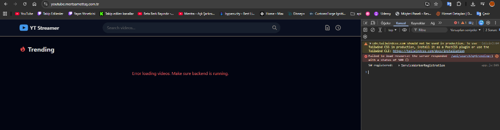

# YouTube MP3/MP4 Downloader & Streamer

A standalone, zero-configuration PHP application that allows users to search for YouTube videos, stream them directly to bypass restrictions, and download them in high-quality MP4 and MP3 formats. 

This project requires **NO Node.js, NO NPM, and NO database**. It runs seamlessly on any shared Linux hosting (like cPanel) out of the box using a smart file-based caching system for blazing-fast search results.

## 🚀 Features

- **Blazing Fast Searches:** Intelligent file-based caching ensures that repeated searches load instantly (0.001s).
- **Direct Streaming:** Proxies streams directly to the client, bypassing common network restrictions.
- **High-Quality Downloads:** Merges video and audio seamlessly for 1080p MP4s and crisp 320k MP3s using integrated `ffmpeg`.
- **Zero Configuration:** Simply upload the files to your server and it works. No databases or complex environments to set up.
- **Beautiful Modern UI:** Dark mode by default with a responsive, app-like experience.
- **Developer API:** Includes a fully documented REST API for mobile app integration.

## 📸 Screenshots

### Modern Dark UI & Instant Search

*The main interface featuring instantaneous trending video loads thanks to smart file-based caching.*

### Video Player & Downloader

*Direct YouTube playback via embed, complete with channel avatars, descriptions, and dynamic MP4/MP3 download options.*

### Interactive API Documentation

*Built-in interactive API documentation (`docs.html`) for seamless integration with mobile apps (Flutter, React Native, etc).*

## 🛠️ Installation (cPanel / Shared Hosting)

1. Download the latest `youtube-saf-php-kurulum.zip` release.
2. Upload the ZIP file to your server (e.g., via cPanel File Manager).
3. Extract the contents into your desired folder (e.g., `public_html/youtube`).
4. **Important:** Give execute permissions (`755`) to the Linux binaries located in the `bin/` directory:
   - `bin/yt-dlp`
   - `bin/ffmpeg`
5. Visit your site and enjoy!

*(For Windows local testing, the repo also includes `.exe` binaries that are automatically detected and used).*

## 🔧 Built With

- **Backend:** Pure PHP (Zero Dependencies)
- **Frontend:** Vanilla JavaScript, HTML5, CSS3
- **Engines:** `yt-dlp` and `ffmpeg` (Local Binaries)

## 📄 License

This project is licensed under the MIT License.
